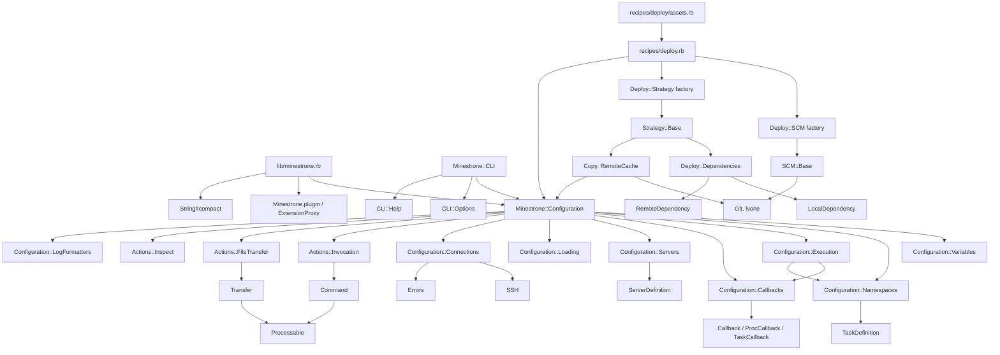

# Minestrone `lib` Codebase Map

This document maps the files under `lib/`, the classes/modules they define, what they are for, and the main internal dependencies between them.

## High-Level Shape

Minestrone is centered on `Minestrone::Configuration`. The root file loads the configuration DSL, extension/plugin support, and a small `String` helper. `Configuration` mixes in modules for variables, task namespaces, callbacks, single-server selection, recipe loading, SSH connection management, command execution, file transfer, and inspection helpers.

Built-in recipes live under `lib/minestrone/recipes`. The deploy recipe composes two plugin families:

- `Minestrone::Deploy::SCM`: source control adapters that return shell commands. This tree currently keeps only Git and the no-SCM local-copy adapter.
- `Minestrone::Deploy::Strategy`: deployment strategies that execute SCM commands locally or remotely.

## File Inventory

| File | Classes/modules defined | Purpose | Main internal dependencies |
| --- | --- | --- | --- |
| `lib/minestrone.rb` | none directly | Main library entry point. Loads the configuration DSL, plugin extension system, and string helper. | `configuration`, `extensions`, `ext/string` |
| `lib/minestrone/callback.rb` | `Minestrone::Callback`, `ProcCallback`, `TaskCallback` | Represents callbacks registered around task lifecycle events. `ProcCallback` calls a block, `TaskCallback` executes another Minestrone task and prevents direct self-recursion. | Used by `configuration/callbacks` |
| `lib/minestrone/cli.rb` | `Minestrone::CLI` | Command-line facade that stores raw args, exposes UI prompts, turns parsed options into a `Configuration`, loads recipes, fires lifecycle hooks, executes requested actions, and handles top-level errors. | `minestrone`, `cli/help`, `cli/options`, `configuration`, `highline` |
| `lib/minestrone/cli/help.rb` | `Minestrone::CLI::Help` | Overrides CLI action execution for `-T` task listing and `-e` task explanation. Formats long help text. | Mixed into `CLI`; uses `TaskDefinition` data through `Configuration#task_list` and `#find_task` |
| `lib/minestrone/cli/help.txt` | none | ERB-like help text used by `CLI::Help#long_help`. | Read by `cli/help` |
| `lib/minestrone/cli/options.rb` | `Minestrone::CLI::Options` | Defines `OptionParser` switches, default config discovery, environment variable extraction, and simple value coercion for `-s` and `-S`. | Mixed into `CLI`; requires `optparse`; uses `Logger`, `Version`, `CLI.password_prompt` |
| `lib/minestrone/command.rb` | `Minestrone::Command` | Single-session remote command runner. Opens one SSH command channel, handles stdout/stderr callbacks, optional pty, environment injection, placeholder replacement, and remote command errors. | `errors`, `processable`, `Configuration.default_io_proc`, SSH session from `connections` |
| `lib/minestrone/configuration.rb` | `Minestrone::Configuration` | Central DSL object. Owns logger/debug/dry-run state, explicitly calls each included module's initialization hook, mixes in all configuration and action modules, and unblocks namespace method shadowing. | `logger`; all `configuration/*`; `configuration/actions/*` |
| `lib/minestrone/configuration/actions/file_transfer.rb` | `Minestrone::Configuration::Actions::FileTransfer` | Adds `put`, `get`, `upload`, `download`, and `transfer` DSL actions. Delegates actual work to `Minestrone::Transfer`. | `transfer`, `Connections#execute_on_server`, `Connections#session`, `run` |
| `lib/minestrone/configuration/actions/inspect.rb` | `Minestrone::Configuration::Actions::Inspect` | Adds `stream` and `capture` actions for running commands and consuming streamed or captured single-server output. | `errors`, `Invocation#invoke_command`, `sudo` |
| `lib/minestrone/configuration/actions/invocation.rb` | `Minestrone::Configuration::Actions::Invocation` | Adds `run`, `invoke_command`, `sudo`, command defaults, sudo prompt handling, and debug prompting. Converts DSL command calls into sequential `Command` execution. | `command`, `Servers#active_server`, `Connections#execute_on_server`, `CLI.debug_prompt`, `Variables` |
| `lib/minestrone/configuration/alias_task.rb` | `Minestrone::Configuration::AliasTask` | Adds `alias_task`, duplicating an existing task under a new name. | `Namespaces#find_task`, `#define_task`, `NoSuchTaskError` |
| `lib/minestrone/configuration/callbacks.rb` | `Minestrone::Configuration::Callbacks` | Adds task lifecycle hooks: `before`, `after`, `on`, `trigger`. Wraps task invocation so callbacks fire around every direct task call. | `callback`, `Execution#invoke_task_directly`, `Execution#find_and_execute_task` |
| `lib/minestrone/configuration/connections.rb` | `Minestrone::Configuration::Connections` | Manages the single SSH session, connection failure state, single-server connection establishment/teardown, and continuing after remote errors where requested. | `ssh`, `errors`, `Servers#active_server`, `Execution#current_task` |
| `lib/minestrone/configuration/execution.rb` | `Minestrone::Configuration::Execution`, `TaskCallFrame` | Runs tasks, tracks the current task stack, implements transactions and `on_rollback`, and locates/executes tasks by name. | `errors`, `Namespaces`, `Callbacks` |
| `lib/minestrone/configuration/loading.rb` | `Minestrone::Configuration::Loading`, `Loading::ClassMethods` | Loads recipes from files, strings, or procs. Provides a Minestrone-aware `require` that lets multiple configuration instances reload recipe DSL effects. | Used by `CLI`, recipes, extensions |
| `lib/minestrone/configuration/log_formatters.rb` | `Minestrone::Configuration::LogFormatters` | DSL for adding logger formatters and disabling formatting. | `logger` |
| `lib/minestrone/configuration/namespaces.rb` | `Minestrone::Configuration::Namespaces`, `Namespaces::Namespace`, `Kernel.method_added` hook | Implements `namespace`, `task`, `desc`, task lookup, namespace lookup, default tasks, and nested namespace forwarding to parent configuration. | `task_definition`, `alias_task`, `execution` |
| `lib/minestrone/configuration/servers.rb` | `Minestrone::Configuration::Servers` | Adds the single-host `server` DSL and resolves the configured server, with `HOST` as a one-host environment override. | `ServerDefinition`, `errors` |
| `lib/minestrone/configuration/variables.rb` | `Minestrone::Configuration::Variables` | Configuration variables with lazy proc evaluation, reset/unset, `fetch`, `[]`, and variable-backed `method_missing`. | Used by nearly every DSL and recipe file |
| `lib/minestrone/errors.rb` | `Minestrone::Error`, `CaptureError`, `NoSuchTaskError`, `NoMatchingServersError`, `RemoteError`, `ConnectionError`, `TransferError`, `CommandError`, `LocalArgumentError` | Shared exception hierarchy. Remote errors carry affected hosts. | Used by command, transfer, connections, execution, recipes, deploy adapters |
| `lib/minestrone/ext/string.rb` | reopens `String` | Adds `String#compact`, collapsing whitespace. Used to make heredoc shell commands one line. | Used by deploy assets and recipe command heredocs |
| `lib/minestrone/extensions.rb` | `Minestrone::ExtensionProxy`, `Minestrone::EXTENSIONS`, plugin methods | Plugin registration system. Adds proxy methods to `Configuration` instances and delegates unknown plugin method calls back to the configuration. | `Configuration`, `Error` |
| `lib/minestrone/logger.rb` | `Minestrone::Logger` | Level-based logger with TTY color/style formatters, timestamp/prepend/append/replace support, and default formatter registration. | Used by `Configuration`, CLI options, command/transfer/strategy/scm code |
| `lib/minestrone/processable.rb` | `Minestrone::Processable`, `Processable::SessionAssociation` | Shared single-session Net::SSH event loop helper. Preprocesses/postprocesses the session with `IO.select` and associates raised errors with that session. | Included by `Command`, `Transfer` |
| `lib/minestrone/recipes/deploy.rb` | recipe methods and tasks only | Primary deployment recipe. Defines deploy variables, helpers (`scm_default`, `depend`, `with_env`, `run_locally`, `try_sudo`, `try_runner`), and tasks for setup, update, update_code, symlinks, upload, rollback, migrations, cleanup, checks, cold deploy, start/stop, pending diff/log, and web maintenance mode. Defaults to Git when `.git` exists and `none` otherwise. | `deploy/scm`, `deploy/strategy`, `dependencies`, `Command`/`Transfer` through configuration actions |
| `lib/minestrone/recipes/deploy/assets.rb` | recipe methods and tasks only | Rails asset-pipeline extension. Hooks into deploy lifecycle to symlink shared assets, precompile, maintain manifest mtimes, clean expired assets, clean all assets, and roll back manifests. | Loads `deploy`; `json`, `yaml` via deploy, `Set` via deploy, `String#compact`, callbacks/tasks/actions |
| `lib/minestrone/recipes/deploy/dependencies.rb` | `Minestrone::Deploy::Dependencies` | Aggregates local and remote dependency checks and reports pass/fail. | `local_dependency`, `remote_dependency` |
| `lib/minestrone/recipes/deploy/local_dependency.rb` | `Minestrone::Deploy::LocalDependency` | Checks local command availability in `PATH`. | Used by `Dependencies`, `Strategy::Copy#check!` |
| `lib/minestrone/recipes/deploy/remote_dependency.rb` | `Minestrone::Deploy::RemoteDependency` | Checks remote directories, files, writability, commands, gems, deb/rpm packages, and expected command output. | `errors`, `Configuration#invoke_command`, `CommandError` |
| `lib/minestrone/recipes/deploy/scm.rb` | `Minestrone::Deploy::SCM` | Factory module for dynamic SCM adapter loading by name. | Dynamic requires `deploy/scm/<name>`; raises `Minestrone::Error` |
| `lib/minestrone/recipes/deploy/scm/base.rb` | `Minestrone::Deploy::SCM::Base`, `Base::LocalProxy` | Abstract SCM adapter API. Provides local-mode variable lookup, command construction, default command handling, logging, and abstract checkout/sync/diff/log/query hooks. | `Configuration` variables and logger; subclassed by all SCM adapters |
| `lib/minestrone/recipes/deploy/scm/git.rb` | `Minestrone::Deploy::SCM::Git` | Git adapter. Supports clone/export/sync, branches/remotes, shallow clones, submodules, diff/log, SHA resolution, and prompt responses for passwords, passphrases, host keys, and certs. | `scm/base`, `CLI.password_prompt` |
| `lib/minestrone/recipes/deploy/scm/none.rb` | `Minestrone::Deploy::SCM::None` | Non-SCM adapter for copying a local directory. Intended for `deploy_via :copy`; no real history support. | `scm/base` |
| `lib/minestrone/recipes/deploy/strategy.rb` | `Minestrone::Deploy::Strategy` | Factory module for dynamic deploy strategy loading by name. | Dynamic requires `deploy/strategy/<name>`; raises `Minestrone::Error` |
| `lib/minestrone/recipes/deploy/strategy/base.rb` | `Minestrone::Deploy::Strategy::Base` | Abstract deployment strategy API. Provides deploy check defaults, configuration method delegation, local `system` logging, and real revision access. | `deploy/dependencies`, `logger`, `Configuration` DSL |
| `lib/minestrone/recipes/deploy/strategy/copy.rb` | `Minestrone::Deploy::Strategy::Copy`, `Copy::Compression` | Local-copy strategy. Checks out/export locally or refreshes a local cache, optionally builds, excludes files, archives, uploads, extracts remotely, and cleans staging artifacts. | `strategy/base`, `fileutils`, `tempfile`, `LocalDependency`, `FileTransfer#upload`, SCM local proxy |
| `lib/minestrone/recipes/deploy/strategy/remote_cache.rb` | `Minestrone::Deploy::Strategy::RemoteCache` | Remote strategy maintaining a shared cached checkout under `shared_path`, then copying/rsyncing it to each release. Handles SCM prompt filtering and writes `REVISION`. | `strategy/base`, SCM `sync`/`checkout`/`handle_data`, remote `rsync` when exclusions exist |
| `lib/minestrone/recipes/standard.rb` | recipe tasks only | Standard recipe loaded by CLI. Defines `invoke` for one-off remote commands. | `configuration/actions/invocation` |
| `lib/minestrone/recipes/templates/maintenance.rhtml` | none | ERB/XHTML maintenance-page template used by `deploy:web:disable`. | Read by `recipes/deploy.rb` |
| `lib/minestrone/server_definition.rb` | `Minestrone::ServerDefinition` | Parses and stores `user@host:port` plus server options. Provides comparison, equality/hash, default user, and string rendering. | Used by `Servers`, `SSH`, `Connections` |
| `lib/minestrone/ssh.rb` | `Minestrone::SSH`, `SSH::Server` | SSH connection helper. Applies the originating `ServerDefinition` to the Net::SSH session and builds public-key-only connection options. | `net/ssh`, `ServerDefinition` |
| `lib/minestrone/task_definition.rb` | `Minestrone::TaskDefinition` | Stores task metadata: name, namespace, options, body, description, and rollback behavior. Formats descriptions and computes fully qualified names. | `server_definition`; used by `configuration/namespaces` and `execution` |
| `lib/minestrone/transfer.rb` | `Minestrone::Transfer`, `Transfer::SFTPTransferWrapper` | Single-session upload/download engine over SFTP or SCP. Normalizes host placeholders and IOs, tracks transfer failure, delegates event processing to `Processable`, and raises `TransferError`. | `net/scp`, `net/sftp`, `processable`, `errors`, SSH session |
| `lib/minestrone/version.rb` | `Minestrone::Version`, `Minestrone::VERSION` | Version constants and string rendering for Minestrone 2.15.11. | Used by CLI `--version` |

## Dependency Graph

This graph shows the main internal runtime clusters rather than every standard-library require.

Saved image: [docs/lib-dependency-graph.svg](lib-dependency-graph.svg)

## Static/Internal Require And Load Dependencies

These are the code-level edges visible from `require` and `load`, excluding Ruby standard-library and gem dependencies unless they are important to the file's role.

| File | Internal files loaded directly |
| --- | --- |
| `lib/minestrone.rb` | `minestrone/configuration`, `minestrone/extensions`, `minestrone/ext/string` |
| `lib/minestrone/cli.rb` | `minestrone`, `minestrone/cli/help`, `minestrone/cli/options`, `minestrone/configuration` |
| `lib/minestrone/cli/options.rb` | dynamically `minestrone/version` for `--version` |
| `lib/minestrone/command.rb` | `minestrone/errors`, `minestrone/processable` |
| `lib/minestrone/configuration.rb` | `minestrone/logger`; all `minestrone/configuration/*`; all `minestrone/configuration/actions/*` |
| `lib/minestrone/configuration/actions/file_transfer.rb` | `minestrone/transfer` |
| `lib/minestrone/configuration/actions/inspect.rb` | `minestrone/errors` |
| `lib/minestrone/configuration/actions/invocation.rb` | `minestrone/command` |
| `lib/minestrone/configuration/callbacks.rb` | `minestrone/callback` |
| `lib/minestrone/configuration/connections.rb` | `minestrone/ssh`, `minestrone/errors` |
| `lib/minestrone/configuration/execution.rb` | `minestrone/errors` |
| `lib/minestrone/configuration/namespaces.rb` | `minestrone/configuration/alias_task`, `minestrone/task_definition` |
| `lib/minestrone/configuration/servers.rb` | `minestrone/server_definition`, `minestrone/errors` |
| `lib/minestrone/recipes/deploy.rb` | `minestrone/recipes/deploy/scm`, `minestrone/recipes/deploy/strategy` |
| `lib/minestrone/recipes/deploy/assets.rb` | `load 'deploy'` unless `_cset` already exists |
| `lib/minestrone/recipes/deploy/dependencies.rb` | `minestrone/recipes/deploy/local_dependency`, `minestrone/recipes/deploy/remote_dependency` |
| `lib/minestrone/recipes/deploy/remote_dependency.rb` | `minestrone/errors` |
| `lib/minestrone/recipes/deploy/scm.rb` | dynamically `minestrone/recipes/deploy/scm/<name>` |
| `lib/minestrone/recipes/deploy/scm/git.rb` | `minestrone/recipes/deploy/scm/base` |
| `lib/minestrone/recipes/deploy/scm/none.rb` | `minestrone/recipes/deploy/scm/base` |
| `lib/minestrone/recipes/deploy/strategy.rb` | dynamically `minestrone/recipes/deploy/strategy/<name>` |
| `lib/minestrone/recipes/deploy/strategy/base.rb` | `minestrone/recipes/deploy/dependencies` |
| `lib/minestrone/recipes/deploy/strategy/remote_cache.rb` | `minestrone/recipes/deploy/strategy/base` |
| `lib/minestrone/recipes/deploy/strategy/copy.rb` | `minestrone/recipes/deploy/strategy/base` |
| `lib/minestrone/task_definition.rb` | `minestrone/server_definition` |
| `lib/minestrone/transfer.rb` | `minestrone/processable` |

## Runtime Usage Notes

- `Configuration` is the central dependency hub. Most recipe and strategy code calls into it through DSL methods mixed in from its modules.
- `Command` and `Transfer` depend on `Processable` because they share the same single-session Net::SSH event-loop pattern.
- `ServerDefinition` is the single configured server identity object. It carries host/user/port/options into the `HOST` override path, SSH connection setup, command placeholders, transfer logging, and error reporting.
- `Callbacks` wraps `Execution#invoke_task_directly`; task lifecycle hooks therefore apply to all direct task execution paths, including CLI actions and recipe-invoked task aliases.
- `Deploy::SCM` and `Deploy::Strategy` are factories. They load adapter files by name and instantiate classes from generated constant names.
- SCM adapters generally do not execute commands. They return shell command strings and prompt handlers. Strategies decide whether those commands run locally, remotely, through caches, or through uploaded archives.
- `Strategy::Copy` is the main bridge from local SCM commands to remote deployment: it uses the SCM's local proxy, local filesystem staging, compression utilities, `upload`, and remote decompression.
- `recipes/deploy/assets.rb` is not a class extension. It is a recipe that mutates the current configuration by setting defaults, registering callbacks, adding helper methods, and defining `deploy:assets:*` tasks.
